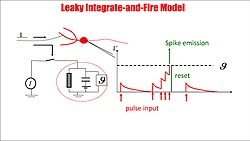

# Goal
To create an open source cognitive model by emulating sensory inputs and utilziing neuromorphic computing principles. Written in Rust. For intial scope, this project will focus on implementing various neuron models and plasticity mechanisms.

## Neuron Models
- Leaky Integrate-and-Fire (LIF)

